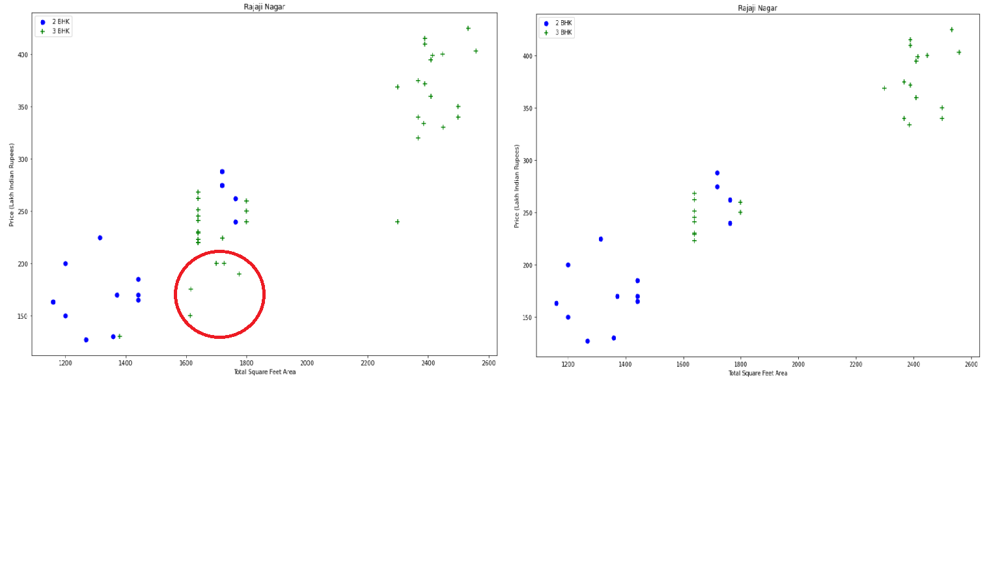
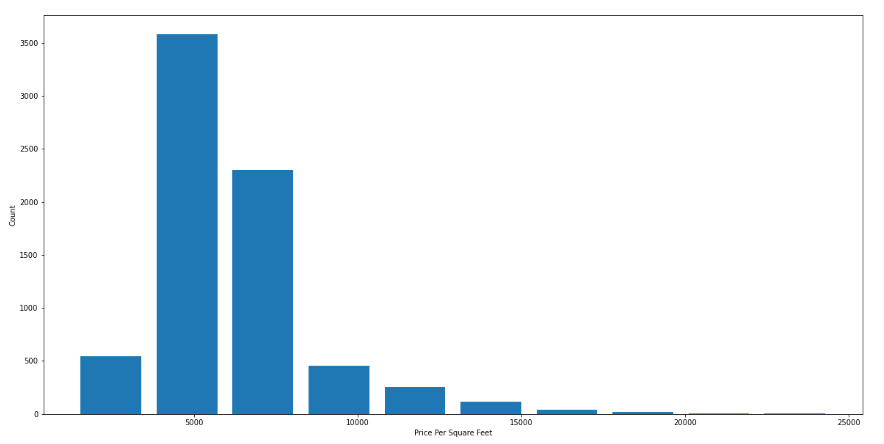
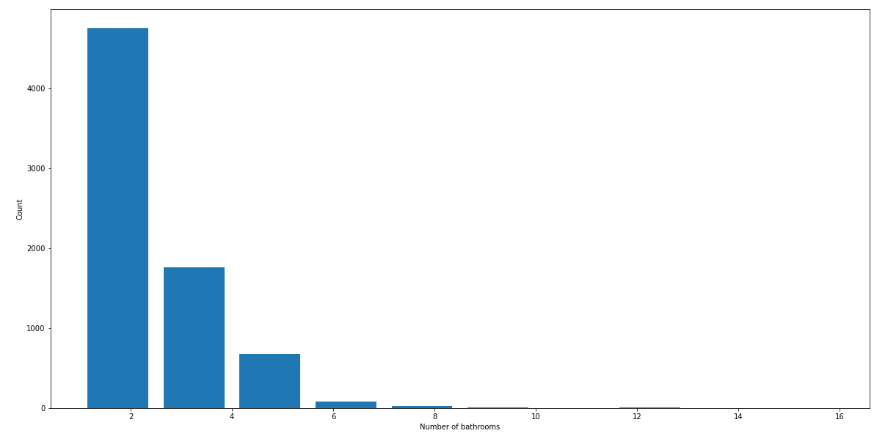

# Real-Estate-Price-Prediction-Project Overview

* Created a tool that predicts home prices from a Kaggle dataset with 85% accuracy.

* Engineered features from the dataset added new features also remove unwanted features using business logic and dimensionality reduction.

* Remove outlier using Standard Deviation and Mean also plot the data to understand better using Matlotlib.

* Optimized Linear Regression, Decision Tree, and Lasso Regression using GridsearchCV to reach the best model.

This data science project series walks through step by step process of how to build a real estate price prediction website. First build a model using sklearn and linear regression using banglore home prices dataset from kaggle.com. Second step would be to write a python flask server that uses the saved model to serve http requests. Third component is the website built in html, css and javascript that allows user to enter home square ft area, bedrooms etc and it will call python flask server to retrieve the predicted price. During model building we will cover almost all data science concepts such as data load and cleaning, outlier detection and removal, feature engineering, dimensionality reduction, gridsearchcv for hyperparameter tunning, k fold cross validation etc. 

## EDA
I looked at the distributions of the data and the value counts for the various categorical variables. Below are a few highlights from the pivot tables.

**Technology and tools wise this project covers:**
1. Python
2. Numpy and Pandas for data cleaning
3. Matplotlib for data visualization
4. Sklearn for model building
5. Jupyter notebook, Visual Studio Code and Spyder as IDE
6. Python flask for http server
7. HTML/CSS/Javascript for UI

## Sources:

**Dataset is downloaded from here:** https://www.kaggle.com/amitabhajoy/bengaluru-house-price-data

**You can view on the details of this project here:** https://www.youtube.com/channel/UCh9nVJoWXmFb7sLApWGcLPQ

